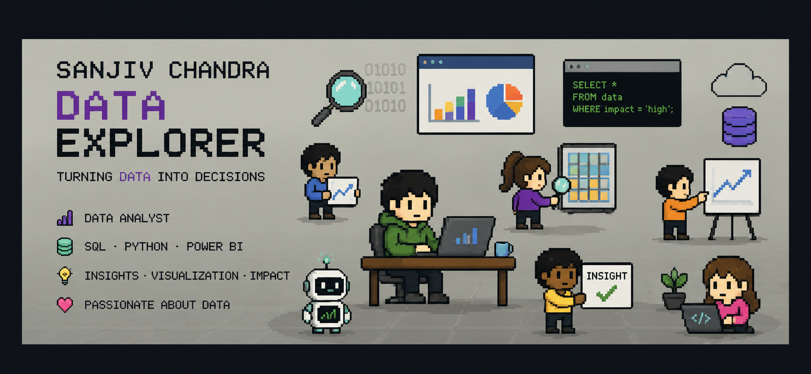

  

<h1 align="center">Hi 👋, I'm Sanjiv Chandra</h1> <h3 align="center">Data Analyst / Data Scientist in the making | Turning raw data into decisions</h3> 
  

### 🔎 About Me
 
- 🎓 Final year B.Tech Computer Science student, Centurion University of Technology and Management 
- 📊 Passionate about **data analytics** — I love finding the story hidden inside a messy dataset
- 🧠 Currently building **RAG pipelines** and **AI-powered data products**
- 🏭 Completed vocational training at **Tata Steel Ltd.** working on real-world sales analytics
- 🌱 Actively preparing for **Data Analyst / Data Scientist** roles in the Indian job market
- 💬 Ask me about Python, SQL, Power BI, Pandas, or LangChain-based RAG apps
---

 ### 🛠️ Tech Stack
 
<h2 align="center">💻 Programming Languages</h2>

  
  

<h2 align="center">📊 Data Analytics & Visualization</h2>

  
  
  
  
  
  
  

<h2 align="center">🤖 Machine Learning</h2>

  

<h2 align="center">🗄️ Databases & Data Warehouses</h2>

  
  
  
  

<h2 align="center">⚙️ Backend & APIs</h2>

  
  
  

<h2 align="center">🌐 Frontend</h2>

  

<h2 align="center">☁️ DevOps & Version Control</h2>

  
  
  

<h2 align="center">🧠 Generative AI & LLM</h2>

  
  
  
  
  
  

<h2 align="left">🌐 Connect With Me</h2>

  

  

  

  

